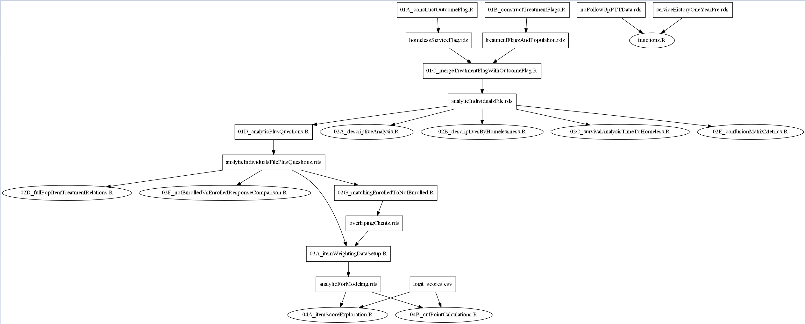

# Overview

getDataDeps is a script that maps data dependencies across R and python files in your project. The tool currently tracks data dependencies for several import/export commands in R, python, and Stata.

# Getting Started

1. Install pydot. You have two options.
   - `conda install pydot`
   - `pip install pydot`
2. Download the script, getDataDeps.py.
3. Navigate to the root of a project directory, such as `cd ~/Desktop/project/statisticsAndStuff`.
4. On the command line run: `python path/to/script/getDataDeps.py`
   - This will map the entire directory. If you wish to map a subdirectory specificy the directory as an option: `python paht/to/script/getDataDeps.py ./code`

If successful, the script will return output to the terminal as well as two files located in dataDepsOutput within the root of your project directory. One of the files will be a png file that contains the graph of how your data flows through the project, such as the one below.

# Helpful tips

1. Limit your import / export commands to two lines
   - The script looks for the import/export commands and then looks a maximum of one line below it.
2. Provide space between your import / export commands and code before or after.
   - For example, if you save your data and put a print statement on the next line the script will see the print line, identify the text in between the quotes and add it to the JSON object.
3. Use the path in the import / export commands.
   - Example: readRDS("./path/to/data.rds") works but readRDS(variableWithPathToData) will not. The script relies on finding the quotes and then extracting what sits between them.

These tips are mostly due to the limitations of how getDataDeps works. Feedback here is greatly appreciated! If there is a specific way you structure your import / exports that isn't covered let me know.

# How it works

The script will iterate through your entire project folder, extract files that end in “.R”, “.py", or ".do", and collect information on data imports and data exports. The JSON object will be saved in the ‘dataDepsOutput’ folder as ‘dataDeps.json’ and the graph as ‘dataDepsGraph.png.

The script will search the entire directory in which it is called. However, you can specify a directory as an option. Here's an example that will run the script on a directory titled 'code': `python path/to/script/getDataDeps.py ./code`
